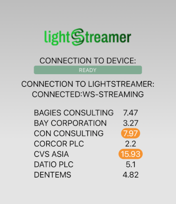

# Lightstreamer - Basic Stock-List Demo - Cordova Client

This project includes a simple demo showing integration between the Lightstreamer JavaScript Client Library and [Cordova](https://cordova.apache.org).

<!-- START DESCRIPTION lightstreamer-example-stocklist-client-cordova -->

<br>

## Details

This demo displays real-time market data for a few stocks generated by a feed simulator and is based on [Basic Stock-List Demo](https://github.com/Lightstreamer/Lightstreamer-example-StockList-client-javascript#basic-stock-list-demo---html-client). <br>
This project shows how is it possible to integrate the <b>JavaScript Client API for Lightstreamer</b> into <b>Cordova</b>, in order to quickly create mobile apps embedding real-time web technologies.

<!-- END DESCRIPTION lightstreamer-example-stocklist-client-cordova -->

## Build

The demo can be built by following these steps:

* Download and install [Node.js](https://nodejs.org/). 
* Get the `lightstreamer.min.js` file from [npm](https://www.npmjs.com/package/lightstreamer-client-web) or [unpkg](https://unpkg.com/lightstreamer-client-web/lightstreamer.min.js) and put it in the folder `www/js` of the demo.
* Install the cordova module by using the command `npm install -g cordova`
* Run the command `cordova build` to build the project for the iOS and Android platforms
* Open the folder `platforms/android` in Android Studio to run the Android demo
* Open the project `platforms/ios/StockListDemo.xcworkspace` in Xcode to run the iOS demo

The demo is configured to connect to the address `https://push.lightstreamer.com`. If you need to target a different Lightstreamer server, please search this line:
```js
var lsClient = new Lightstreamer.LightstreamerClient("https://push.lightstreamer.com","DEMO");
```
in `www/js/index.js` and change it accordingly.<br>

## See Also

 [Lightstreamer - Stock-List Demos - HTML Clients](https://github.com/Lightstreamer/Lightstreamer-example-StockList-client-javascript#basic-stock-list-demo---html-client)
* [Lightstreamer - Basic Stock-List Demo - Flutter](https://github.com/Lightstreamer/Lightstreamer-example-StockList-client-flutter)
* [Lightstreamer - Basic Stock-List Demo - React Native](https://github.com/Lightstreamer/Lightstreamer-example-StockList-client-reactnative)
* [Lightstreamer - Basic Stock-List Demo - Electron](https://github.com/Lightstreamer/Lightstreamer-example-StockList-client-electron)

## Lightstreamer Compatibility Notes

* Compatible with Lightstreamer Web Client SDK 9.0 and Lightstreamer Server 7.4.

* For a version of this example compatible with Lightstreamer SDK for Web Clients version 7.x or earlier, please refer to [this tag](https://github.com/Lightstreamer/Lightstreamer-example-StockList-client-cordova/releases/tag/latest-for-client-7.x).
