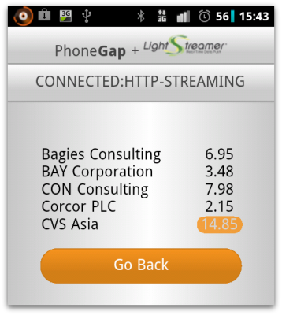

# Lightstreamer - Basic Stock-List Demo - PhoneGap Client

This project includes a simple demo showing integration between the <b>Lightstreamer JavaScript Client Library</b> and <b>PhoneGap</b>.

<!-- START DESCRIPTION lightstreamer-example-stocklist-client-phonegap -->

 

## Details

The demo application extends the [PhoneGap Hello World](https://github.com/phonegap/phonegap-start) application by adding a section that shows some stock quotes from the [Lightstreamer - Stock-List Demo - Java Adapter](https://github.com/Lightstreamer/Lightstreamer-example-Stocklist-adapter-java) and a box that shows the status of the connection to the Lightstreamer Server.

<!-- END DESCRIPTION lightstreamer-example-stocklist-client-phonegap -->

## Build

The demo code can be built using the [PhoneGap:Build](https://build.phonegap.com/) website: simply create a new application on the website and point it to the GitHub project to be built.

## See Also

* [Lightstreamer in a PhoneGap app](http://blog.lightstreamer.com/2012/08/lightstreamer-in-phonegap-app.html)
* [PhoneGap](http://phonegap.com/)

<!-- START RELATED_ENTRIES -->

### Lightstreamer Adapters Needed by This Demo Client

* [Lightstreamer - Stock-List Demo - Java Adapter](https://github.com/Lightstreamer/Lightstreamer-example-Stocklist-adapter-java)

<!-- END RELATED_ENTRIES -->

## Lightstreamer Compatibility Notes

*  Compatible with Lightstreamer JavaScript Client library version 6.0 to 7.x.
